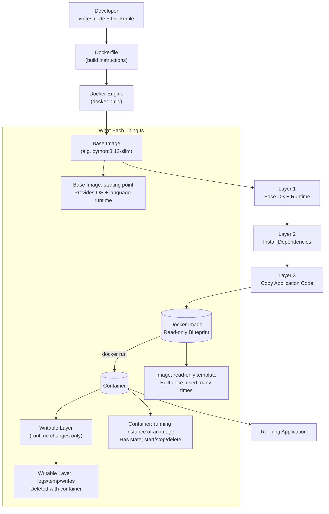

# Complete Docker Guide: From Zero to Hero

**A comprehensive guide to understanding Docker for developers**

## Table of Contents

1. [What is Docker?](#what-is-docker)
2. [Core Concepts](#core-concepts)
3. [Docker Architecture](#docker-architecture)
4. [Images Explained](#images-explained)
5. [Containers Explained](#containers-explained)
6. [Volumes](#volumes)
7. [Networks](#networks)
8. [Docker Compose](#docker-compose)
9. [Dockerfile](#dockerfile)
10. [Commands Reference](#commands-reference)
11. [Best Practices](#best-practices)
12. [Real-World Examples](#real-world-examples)
13. [Troubleshooting](#troubleshooting)

# Container

A piece of software that contains all the dependencies that our application needs to run.
it contains:

- The code.
- Runtime environment.
- Libraries and dependencies.
- System tools and settings.

# Docker

A tool for creating ,managing, and running the containers.

with the tools it contains, it helps us to:

- package the application and its dependencies into a container
- run containers in development, testing or production environment

#### An image is a built blueprint, a container is a running instance of that blueprint, and Docker is the tool that builds and runs them.



# What is Docker?

## The Simple Explanation

**Docker is like a shipping container for software.**

Just like shipping containers:

- Package everything needed inside
- Can be moved anywhere
- Works the same everywhere
- Isolated from other containers

## The Technical Definition

Docker is a **platform for developing, shipping, and running applications in containers**.

A container packages:

- Your application code
- All dependencies (libraries, tools)
- Configuration files
- Runtime environment

Into a **single, portable unit** that runs consistently anywhere.

## Why Docker Exists: The Problem It Solves

### The Old Problem: "It Works on My Machine"

**Before Docker:**

```
Developer's Laptop:
- Python 3.11
- PostgreSQL 12
- Specific libraries
App works perfectly

Production Server:
- Python 3.8
- PostgreSQL 14
- Different libraries

App breaks!
```

**The nightmare:**

- "But it works on my machine!"
- Hours spent debugging environment differences
- Different setups for dev, test, production
- Dependency conflicts

### The Docker Solution

**With Docker:**

```
Developer creates Docker container:
- Includes Python 3.11
- Includes PostgreSQL 12
- Includes ALL libraries
- Includes configuration

Same container runs:
On developer's laptop
On test server
On production server
On your teammate's computer

Identical environment everywhere!
```

## Real-World Analogy

### Shipping Containers vs Docker Containers

**Physical Shipping Containers:**

- Standard size/shape
- Can hold anything (furniture, electronics, food)
- Loaded on ships, trucks, trains the same way
- Doesn't matter what's inside - shipping works the same

**Docker Containers:**

- Standard format
- Can hold any application (web app, database, API)
- Run on any computer/server the same way
- Doesn't matter what's inside - Docker runs it the same

# Core Concepts

## The Three Main Components

### 1. Docker Image (The Blueprint)

**What it is:**

- A **template** or **blueprint** for creating containers
- Like a **recipe** or **class definition** in programming
- **Read-only** - never changes once created
- Contains everything needed to run an application

**Real-world analogy:**

- Image = House blueprint
- Container = Actual house built from blueprint
- You can build many houses (containers) from one blueprint (image)

**Example:**

```
Image: "odoo:18"
Contains:
- Ubuntu Linux
- Python 3.11
- Odoo 18 source code
- All Python dependencies
- Configuration defaults
```

### 2. Docker Container (The Running Instance)

**What it is:**

- A **running instance** of an image
- Like an **object** created from a class in programming
- **Writable** - can change while running
- Isolated environment with its own filesystem, processes, network

**Real-world analogy:**

- Container = Running program
- Image = Program installer/executable
- You can run multiple instances (containers) from one installer (image)

**Example:**

```
From image "odoo:18" you can create:
- Container 1: Development Odoo
- Container 2: Test Odoo
- Container 3: Training Odoo

All from the same image, but each is separate and independent.
```

### 3. Docker Registry (The Library)

**What it is:**

- A **storage and distribution system** for images
- Like **GitHub for Docker images**
- **Docker Hub** is the main public registry

**Real-world analogy:**

- Registry = App Store / Library
- Images = Apps / Books
- You download (pull) images from registry to use them

**Examples:**

```
Docker Hub (hub.docker.com):
- odoo:18
- postgres:15
- nginx:latest
- python:3.11
- redis:7

Public images free to download!
```

## The Relationship Between Components

```
┌─────────────────────────────────────────┐
│         DOCKER REGISTRY                 │
│         (Docker Hub)                    │
│                                         │
│   odoo:18                            │
│   postgres:15                        │
│   nginx:latest                       │
└─────────────────────────────────────────┘
           ↓
           docker pull
           ↓
┌─────────────────────────────────────────┐
│      YOUR COMPUTER                      │
│                                         │
│  IMAGES (Blueprints):                  │
│   odoo:18        (stored locally)    │
│   postgres:15    (stored locally)    │
│           ↓ docker run                 │
│           ↓                            │
│  CONTAINERS (Running):                 │
│    app_odoo    (running)          │
│    app_db      (running)          │
└─────────────────────────────────────────┘
```

# Docker Architecture

## How Docker Works Internally

### The Docker Engine

Docker has a **client-server architecture**:

```
┌──────────────────────────────────────────────┐
│   YOUR COMMANDS                              │
│  $ docker run odoo:18                        │
└──────────────────────────────────────────────┘
            ↓
┌──────────────────────────────────────────────┐
│  DOCKER CLIENT (CLI)                         │
│  - Parses your commands                      │
│  - Sends to Docker daemon                    │
└──────────────────────────────────────────────┘
            ↓
┌──────────────────────────────────────────────┐
│  DOCKER DAEMON (dockerd)                     │
│  - Core engine                               │
│  - Manages images, containers, networks      │
│  - Does the actual work                      │
└──────────────────────────────────────────────┘
            ↓
┌──────────────────────────────────────────────┐
│  HOST OPERATING SYSTEM                       │
│  - Linux kernel (or VM on Mac/Windows)       │
│  - Provides isolation features               │
└──────────────────────────────────────────────┘
```

### Docker Desktop

**Docker Desktop includes:**

1. **Docker Engine** - The core
2. **Docker CLI** - Command line tools
3. **Docker Compose** - Multi-container tool
4. **GUI** - Visual interface
5. **VM** (on Mac/Windows) - Runs Linux kernel

**Why VM on Mac?**

- Docker needs Linux kernel features
- Mac doesn't have Linux kernel
- Docker Desktop creates a lightweight Linux VM
- Your containers run inside this VM
- You don't see/manage the VM directly

```
┌─────────────────────────────────────────┐
│                macOS                    |
│                                         │
│  ┌───────────────────────────────────┐ │
│  │  Docker Desktop                   │ │
│  │                                   │ │
│  │  ┌─────────────────────────────┐ │ │
│  │  │  Linux VM                   │ │ │
│  │  │                             │ │ │
│  │  │    Containers run here    │ │ │
│  │  │    app_odoo             │ │ │
│  │  │    app_db              │ │ │
│  │  └─────────────────────────────┘ │ │
│  └───────────────────────────────────┘ │
└─────────────────────────────────────────┘
```

## Container Isolation: How It Works

### What Makes Containers Isolated?

Containers use Linux kernel features:

1. **Namespaces** - Separate view of system resources
2. **Cgroups** - Limit resource usage
3. **Union File System** - Layered filesystem

**Namespaces provide isolation for:**

- **PID** - Process IDs (container sees only its processes)
- **NET** - Network (container has its own network stack)
- **MNT** - Filesystem (container has its own root filesystem)
- **UTS** - Hostname (container has its own hostname)
- **IPC** - Inter-process communication
- **USER** - User IDs

### Example: Process Isolation

**Inside Container:**

```bash
# Container sees only its own processes
$ ps aux
USER  PID  COMMAND
root   1   /usr/bin/python odoo-bin
root  23   postgres
```

**On Host (Your Mac):**

```bash
# Host sees all processes including container processes
$ ps aux | grep odoo
user  1455  docker-containerd odoo
user  1456  /usr/bin/python odoo-bin
```

**Same process, different PID!**

- Inside container: PID 1
- On host: PID 1456

This is namespace isolation in action.

# Images Explained

## What is a Docker Image?

### The Layers Concept

Images are built in \*\_layers.

```
┌─────────────────────────────────┐
│  Layer 4: Odoo Application      │  ← Your app
├─────────────────────────────────┤
│  Layer 3: Python packages       │  ← Dependencies
├─────────────────────────────────┤
│  Layer 2: Python 3.11           │  ← Runtime
├─────────────────────────────────┤
│  Layer 1: Ubuntu base           │  ← OS
└─────────────────────────────────┘
```

**Why layers?**

- **Efficiency**: Shared layers save space
- **Speed**: Only download new layers
- **Caching**: Reuse unchanged layers

### Layer Sharing Example

```
Image 1: odoo:18
├── Ubuntu (100 MB)
├── Python 3.11 (50 MB)
├── Odoo dependencies (200 MB)
└── Odoo 18 (100 MB)
Total: 450 MB

Image 2: python:3.11
├── Ubuntu (100 MB)      ← SHARED!
├── Python 3.11 (50 MB)  ← SHARED!
└── Python tools (20 MB)
Total: 170 MB

Total space used: 450 + 20 = 470 MB (not 620 MB!)
```

Layers 1 and 2 are shared, saved 150 MB!

## Image Naming Convention

### Format: `repository:tag`

```
postgres:15
│        │
│        └─ Tag (version)
└─────────── Repository (name)

Full format:
registry/namespace/repository:tag

Examples:
docker.io/library/postgres:15
│         │       │        │
│         │       │        └─ Tag
│         │       └────────── Repository
│         └────────────────── Namespace
└──────────────────────────── Registry

Short form (defaults):
postgres:15
= docker.io/library/postgres:15
```

### Common Tags

```
odoo:18          - Odoo version 18
odoo:latest      - Latest version (⚠️ moves over time)
odoo:18.0        - More specific version
postgres:15      - PostgreSQL 15
postgres:15.3    - Even more specific
python:3.11      - Python 3.11
python:3.11-slim - Smaller version
```

**Best practice:** Use specific versions (not `latest`)

## Image Commands

### Pulling Images

```bash
# Download image from Docker Hub
docker pull odoo:18

# What happens:
# 1. Connects to Docker Hub
# 2. Downloads all layers
# 3. Stores locally
# 4. Ready to create containers
```

### Listing Images

```bash
# List all images on your computer
docker images

# Output:
REPOSITORY   TAG    IMAGE ID      CREATED       SIZE
odoo         18     a1b2c3d4e5f6  2 weeks ago   1.2GB
postgres     15     f6e5d4c3b2a1  3 weeks ago   379MB
```

**Understanding output:**

- **REPOSITORY**: Image name
- **TAG**: Version
- **IMAGE ID**: Unique identifier (like fingerprint)
- **CREATED**: When image was built
- **SIZE**: Total size (all layers)

### Removing Images

```bash
# Remove by name
docker rmi odoo:18

# Remove by ID
docker rmi a1b2c3d4e5f6

# Remove all unused images
docker image prune

# Remove ALL images (careful!)
docker rmi $(docker images -q)
```

### Inspecting Images

```bash
# See detailed information
docker inspect odoo:18

# See layers
docker history odoo:18

# Output shows each layer:
IMAGE          CREATED BY                                      SIZE
a1b2c3d4e5f6   /bin/sh -c #(nop) CMD ["odoo"]                 0B
b2c3d4e5f6a1   /bin/sh -c pip install -r requirements.txt     200MB
c3d4e5f6a1b2   /bin/sh -c apt-get install python3.11          50MB
```

## Where Images are Stored

**On Mac (Docker Desktop):**

```
~/Library/Containers/com.docker.docker/Data/
```

**You don't need to access this directly** - Docker manages it.

**To see space used:**

```bash
docker system df

# Output:
TYPE            TOTAL    ACTIVE   SIZE
Images          5        2        2.1GB
Containers      10       2        450MB
Local Volumes   3        2        1.2GB
```

# Containers Explained

## What is a Container?

### Container = Running Image

**Think of it as:**

- Image = Program on disk (.exe file)
- Container = Running program (in Task Manager)

**Or:**

- Image = Recipe
- Container = Cooked meal

**Or:**

- Image = Class (in programming)
- Container = Object instance

## Container Lifecycle

```
┌─────────────────────────────────────────┐
│  1. CREATED                             │
│  docker create odoo:18                  │
│  Container exists but not running       │
└─────────────────────────────────────────┘
            ↓
┌─────────────────────────────────────────┐
│  2. RUNNING                             │
│  docker start <container>               │
│  Container is executing processes       │
└─────────────────────────────────────────┘
            ↓
┌─────────────────────────────────────────┐
│  3. PAUSED (optional)                   │
│  docker pause <container>               │
│  Processes frozen but container alive   │
└─────────────────────────────────────────┘
            ↓
┌─────────────────────────────────────────┐
│  4. STOPPED                             │
│  docker stop <container>                │
│  Container stopped, data preserved      │
└─────────────────────────────────────────┘
            ↓
┌─────────────────────────────────────────┐
│  5. REMOVED                             │
│  docker rm <container>                  │
│  Container deleted (image remains)      │
└─────────────────────────────────────────┘
```

## Creating and Running Containers

### The `docker run` Command

**This is the most common command:**

```bash
docker run [OPTIONS] IMAGE [COMMAND]
```

**Simple example:**

```bash
docker run odoo:18
```

This does multiple things:

1. Creates a container from `odoo:18` image
2. Starts the container
3. Runs the default command (starts Odoo)

### Common Options

```bash
docker run \
  --name app_odoo \        # Give container a name
  -d \                         # Run in background (detached)
  -p 8069:8069 \              # Map ports
  -e HOST=db \                # Set environment variable
  -v ./data:/var/lib/odoo \   # Mount volume
  --restart always \           # Auto-restart policy
  odoo:18                      # Image to use
```

**Let's break down each option:**

#### `--name` - Container Name

```bash
--name app_odoo
```

**Without name:**

- Docker assigns random name (e.g., `angry_einstein`)
- Hard to remember/identify

**With name:**

- Easy to reference: `docker stop app_odoo`
- Meaningful in logs and lists

#### `-d` - Detached Mode

```bash
-d
```

**Without `-d` (foreground):**

```bash
docker run odoo:18
# Terminal shows Odoo logs
# Ctrl+C stops container
# Terminal locked
```

**With `-d` (background):**

```bash
docker run -d odoo:18
# Returns container ID
# Terminal free
# Container runs in background
# View logs: docker logs <container>
```

#### `-p` - Port Mapping

```bash
-p 8069:8069
#  HOST:CONTAINER
```

**Why needed?**

- Containers have their own network
- Container port 8069 is NOT accessible from your Mac
- Port mapping creates a bridge

**Example:**

```
Your Mac:8069 → Container:8069
│               │
Browser         Odoo inside container
```

**Multiple mappings:**

```bash
-p 8069:8069 \     # Web interface
-p 8072:8072       # Long polling (chat)
```

**Different host port:**

```bash
-p 8070:8069       # Access on localhost:8070
                   # Goes to container port 8069
```

#### `-e` - Environment Variables

```bash
-e HOST=db
-e USER=odoo
-e PASSWORD=odoo
```

**What they do:**

- Pass configuration to container
- Container reads these at startup
- Like command-line arguments

**In your Odoo example:**

```bash
-e HOST=db          # PostgreSQL hostname
-e USER=odoo        # Database username
-e PASSWORD=odoo    # Database password
```

Inside container, Odoo code reads:

```python
db_host = os.environ.get('HOST')      # = 'db'
db_user = os.environ.get('USER')      # = 'odoo'
db_password = os.environ.get('PASSWORD')  # = 'odoo'
```

#### `-v` - Volumes (Data Persistence)

```bash
-v ./custom_addons:/mnt/extra-addons
#  HOST PATH      :CONTAINER PATH
```

**Why needed?**

- Container filesystem is temporary
- When container deleted, data lost
- Volumes persist data outside container

**Two types:**

**1. Bind Mount (Folder on your Mac):**

```bash
-v /Users/you/code:/mnt/code
#  Your Mac folder  :Inside container
```

**2. Named Volume (Docker managed):**

```bash
-v odoo-data:/var/lib/odoo
#  Volume name :Inside container
```

**Your Odoo example:**

```bash
-v ./custom_addons:/mnt/extra-addons
   │                │
   On your Mac      Inside container

Your code on Mac → Visible inside container
You edit on Mac  → Container sees changes
```

#### `--restart` - Restart Policy

```bash
--restart always
```

**Options:**

- `no` - Never restart (default)
- `always` - Always restart if stopped
- `unless-stopped` - Restart unless manually stopped
- `on-failure` - Restart only if crashes

**Production use:**

```bash
--restart always
```

If server reboots, container auto-starts!

### Container Commands

```bash
# List running containers
docker ps

# List all containers (including stopped)
docker ps -a

# Start stopped container
docker start app_odoo

# Stop running container
docker stop app_odoo

# Restart container
docker restart app_odoo

# Remove container
docker rm app_odoo

# Remove running container (force)
docker rm -f app_odoo

# View logs
docker logs app_odoo

# Follow logs (live)
docker logs -f app_odoo

# Execute command in running container
docker exec app_odoo ls -la

# Open shell in running container
docker exec -it app_odoo bash

# View container details
docker inspect app_odoo

# View resource usage
docker stats app_odoo
```

## Container Filesystem

### How Container Filesystem Works

**Containers have layered filesystem:**

```
┌─────────────────────────────────────┐
│  READ-WRITE Layer                   │  ← Container changes
│  (Temporary, lost when deleted)     │
├─────────────────────────────────────┤
│  Image Layer 4                      │  ← Read-only
├─────────────────────────────────────┤
│  Image Layer 3                      │  ← Read-only
├─────────────────────────────────────┤
│  Image Layer 2                      │  ← Read-only
├─────────────────────────────────────┤
│  Image Layer 1                      │  ← Read-only
└─────────────────────────────────────┘
```

**What this means:**

- Image layers are read-only (shared by all containers)
- Container has its own writable layer on top
- Changes only in writable layer
- When container deleted, writable layer deleted
- Image layers remain unchanged

### Example: File Changes

```bash
# Start container
docker run -it ubuntu:20.04 bash

# Inside container, create file
root@abc123:/# echo "test" > /tmp/myfile.txt
root@abc123:/# cat /tmp/myfile.txt
test

# Exit container
root@abc123:/# exit

# Start SAME container again
docker start -i abc123
root@abc123:/# cat /tmp/myfile.txt
test  ← File still exists!

# Remove container
docker rm abc123

# Start NEW container from same image
docker run -it ubuntu:20.04 bash
root@def456:/# cat /tmp/myfile.txt
cat: /tmp/myfile.txt: No such file
      ↑
      File gone! (Different container)
```

**Key point:** Data in container is temporary unless using volumes.

# Volumes

## What are Volumes?

**Volumes = Persistent storage outside container**

**Why needed?**

- Container filesystem is temporary
- Need to save data (databases, uploads, config)
- Share data between containers
- Backup and restore data

## Types of Volumes

### 1. Named Volumes (Docker Managed)

```bash
docker volume create my-volume

docker run -v my-volume:/data myapp
```

**Characteristics:**

- Docker manages storage location
- Easy to backup/restore
- Can be shared between containers
- Survive container deletion

**Where stored?**

- Mac: `~/Library/Containers/com.docker.docker/Data/`
- Linux: `/var/lib/docker/volumes/`

**You don't access directly** - use Docker commands.

### 2. Bind Mounts (Your Folder)

```bash
docker run -v /Users/you/code:/app myapp
#             └─ Your Mac path
#                              └─ Container path
```

**Characteristics:**

- You specify exact path on host
- Direct access to files
- Good for development (edit code on Mac, see in container)
- Less portable

### 3. tmpfs Mounts (In-Memory)

```bash
docker run --tmpfs /app/temp myapp
```

**Characteristics:**

- Stored in RAM (not disk)
- Very fast
- Lost when container stops
- Good for temporary data

## Volume Commands

```bash
# Create volume
docker volume create odoo-data

# List volumes
docker volume ls

# Inspect volume
docker volume inspect odoo-data

# Output:
[
    {
        "Name": "odoo-data",
        "Driver": "local",
        "Mountpoint": "/var/lib/docker/volumes/odoo-data/_data",
        "Created": "2026-02-01T10:00:00Z"
    }
]

# Remove volume
docker volume rm odoo-data

# Remove unused volumes
docker volume prune

# Remove all volumes (careful!)
docker volume rm $(docker volume ls -q)
```

## Using Volumes in Docker Compose

```yaml
services:
  db:
    image: postgres:15
    volumes:
      - db-data:/var/lib/postgresql/data
      #  └─ Named volume
      #                └─ Container path

  odoo:
    image: odoo:18
    volumes:
      - ./custom_addons:/mnt/extra-addons
      #  └─ Bind mount (your Mac folder)
      - odoo-data:/var/lib/odoo
      #  └─ Named volume

volumes:
  db-data: # Define named volumes
  odoo-data:
```

## Volume Backup and Restore

### Backup Volume

```bash
# Create backup of volume
docker run --rm \
  -v odoo-data:/data \
  -v $(pwd):/backup \
  ubuntu \
  tar czf /backup/odoo-backup.tar.gz /data
```

**What this does:**

1. Runs temporary Ubuntu container
2. Mounts `odoo-data` volume to `/data`
3. Mounts current directory to `/backup`
4. Creates compressed backup
5. Container removed (`--rm`)

### Restore Volume

```bash
# Restore backup to volume
docker run --rm \
  -v odoo-data:/data \
  -v $(pwd):/backup \
  ubuntu \
  tar xzf /backup/odoo-backup.tar.gz -C /
```

# Networks

## What are Docker Networks?

**Networks allow containers to communicate.**

**Default behavior:**

- Each container has its own network
- Containers can't talk to each other
- Need network to connect them

## Network Types

### 1. Bridge Network (Default)

```bash
docker network create my-network

docker run --network my-network --name app1 myapp
docker run --network my-network --name app2 myapp
```

**Characteristics:**

- Containers on same network can talk to each other
- Use container name as hostname
- Isolated from other networks

**Example:**

```
Container app1: ping app2  ← Works!
Container app1: ping app3  ← Fails (different network)
```

### 2. Host Network

```bash
docker run --network host myapp
```

**Characteristics:**

- Container uses host's network directly
- No isolation
- No port mapping needed
- Linux only (doesn't work well on Mac/Windows)

### 3. None Network

```bash
docker run --network none myapp
```

**Characteristics:**

- No network access
- Completely isolated
- Good for security/testing

## How Containers Communicate

### Without Docker Compose

```bash
# Create network
docker network create app-network

# Start database
docker run -d \
  --name app_db \
  --network app-network \
  postgres:15

# Start Odoo
docker run -d \
  --name app_odoo \
  --network app-network \
  -e HOST=app_db \
  odoo:18
```

**Inside Odoo container:**

```python
# Can connect to database using container name
host = "app_db"  # Docker DNS resolves this!
```

### With Docker Compose (Automatic)

```yaml
services:
  db:
    image: postgres:15
    # Automatically on network "app_default"

  odoo:
    image: odoo:18
    environment:
      HOST: db # Can use service name!
    # Automatically on same network
```

**Docker Compose automatically:**

- Creates network
- Connects all services to it
- Sets up DNS (service names work as hostnames)

## Network Commands

```bash
# List networks
docker network ls

# Create network
docker network create my-network

# Inspect network
docker network inspect my-network

# Connect container to network
docker network connect my-network container-name

# Disconnect container from network
docker network disconnect my-network container-name

# Remove network
docker network rm my-network

# Remove unused networks
docker network prune
```

## DNS Resolution in Docker

**How `HOST=db` works:**

```
┌─────────────────────────────────────┐
│  Docker Network: app_default     │
│                                     │
│  ┌──────────────┐  ┌─────────────┐ │
│  │ Container:   │  │ Container:  │ │
│  │ app_odoo  │  │ app_db   │ │
│  │              │  │             │ │
│  │ Connects to: │  │ Hostname:   │ │
│  │ db:5432  ────┼──► db          │ │
│  │              │  │ IP: 172.18. │ │
│  └──────────────┘  └─────────────┘ │
│                                     │
│  Docker DNS Server:                 │
│  db → 172.18.0.2                   │
└─────────────────────────────────────┘
```

**Docker provides:**

- Built-in DNS server
- Automatic hostname resolution
- Service name = hostname

# Docker Compose

## What is Docker Compose?

**Docker Compose = Tool for defining multi-container applications**

**Problem it solves:**

- Running multiple containers manually is tedious
- Many `docker run` commands
- Hard to remember all options
- Error-prone

**Solution:**

- Define all containers in one file (`docker-compose.yml`)
- Start everything with one command
- Manage as a unit

## docker-compose.yml Structure

### Basic Structure

```yaml
services: # Define containers
  service1: # Container 1
    image: ...
    ports: ...

  service2: # Container 2
    image: ...
    volumes: ...

volumes: # Define volumes
  volume1:
  volume2:

networks: # Define networks (optional)
  network1:
```

### Your Odoo Example Explained

```yaml
services:
  # PostgreSQL Database Container
  db:
    image: postgres:15
    # └─ Use official PostgreSQL 15 image

    container_name: app_db
    # └─ Name this container "app_db"

    environment:
      POSTGRES_USER: odoo
      POSTGRES_PASSWORD: odoo
      POSTGRES_DB: postgres
    # └─ Set environment variables for PostgreSQL
    #    Creates user "odoo" with password "odoo"
    #    Creates database "postgres"

    volumes:
      - db-data:/var/lib/postgresql/data
    # └─ Persist database files in "db-data" volume
    #    Data survives container deletion

    restart: always
    # └─ Auto-restart if container crashes or server reboots

    healthcheck:
      test: ["CMD-SHELL", "pg_isready -U odoo -d postgres"]
      interval: 5s
      timeout: 5s
      retries: 10
    # └─ Check if PostgreSQL is ready
    #    Runs `pg_isready` command every 5 seconds
    #    Retries 10 times before marking unhealthy

  # Odoo Application Container
  odoo:
    image: odoo:18
    # └─ Use official Odoo 18 image

    container_name: app_odoo
    # └─ Name this container "app_odoo"

    depends_on:
      db:
        condition: service_healthy
    # └─ Don't start Odoo until PostgreSQL is healthy
    #    Ensures database is ready before Odoo starts

    ports:
      - "8069:8069"
    # └─ Map port 8069 on Mac to port 8069 in container
    #    Access Odoo at http://localhost:8069

    volumes:
      - ./custom_addons:/mnt/extra-addons
      - odoo-data:/var/lib/odoo
    # └─ Mount custom_addons folder (your code)
    #    Mount odoo-data volume (file uploads, sessions)

    environment:
      HOST: db
      USER: odoo
      PASSWORD: odoo
    # └─ Tell Odoo how to connect to PostgreSQL
    #    HOST=db uses service name (Docker DNS)

    restart: always
    # └─ Auto-restart policy

# Define named volumes
volumes:
  db-data: {} # PostgreSQL data
  odoo-data: {} # Odoo filestore
```

## Docker Compose Commands

### Starting Services

```bash
# Start all services
docker-compose up

# Start in background (detached)
docker-compose up -d

# Start specific service
docker-compose up odoo

# Rebuild and start
docker-compose up --build

# Force recreate containers
docker-compose up --force-recreate
```

### Stopping Services

```bash
# Stop all services
docker-compose stop

# Stop specific service
docker-compose stop odoo

# Stop and remove containers
docker-compose down

# Stop and remove containers + volumes
docker-compose down -v

# Stop and remove everything (images too)
docker-compose down --rmi all -v
```

### Managing Services

```bash
# List running services
docker-compose ps

# View logs
docker-compose logs

# Follow logs
docker-compose logs -f

# Logs for specific service
docker-compose logs odoo

# Restart services
docker-compose restart

# Restart specific service
docker-compose restart odoo

# Execute command in service
docker-compose exec odoo bash

# Run one-off command
docker-compose run odoo python --version
```

### Scaling Services

```bash
# Run multiple instances
docker-compose up -d --scale odoo=3

# Creates:
# - app_odoo_1
# - app_odoo_2
# - app_odoo_3
```

## Advanced Docker Compose Features

### Environment Files

**Create `.env` file:**

```env
POSTGRES_USER=odoo
POSTGRES_PASSWORD=secret123
ODOO_VERSION=18
```

**Use in docker-compose.yml:**

```yaml
services:
  db:
    image: postgres:15
    environment:
      POSTGRES_USER: ${POSTGRES_USER}
      POSTGRES_PASSWORD: ${POSTGRES_PASSWORD}

  odoo:
    image: odoo:${ODOO_VERSION}
```

### Multiple Compose Files

**Base configuration:**
`docker-compose.yml`

**Development overrides:**
`docker-compose.override.yml`

**Production:**

```bash
docker-compose -f docker-compose.yml -f docker-compose.prod.yml up
```

### Health Checks

```yaml
healthcheck:
  test: ["CMD", "curl", "-f", "http://localhost:8069"]
  interval: 30s
  timeout: 10s
  retries: 3
  start_period: 40s
```

**What it does:**

- Runs health check every 30 seconds
- Marks unhealthy after 3 failures
- Other services can wait for healthy status

### Resource Limits

```yaml
services:
  odoo:
    image: odoo:18
    deploy:
      resources:
        limits:
          cpus: "2.0"
          memory: 2G
        reservations:
          cpus: "1.0"
          memory: 1G
```

# Dockerfile

## What is a Dockerfile?

**Dockerfile = Recipe for building custom images**

**When you need it:**

- Official images don't have what you need
- Want to include your code in image
- Need custom configuration
- Building your own application

## Dockerfile Syntax

### Basic Structure

```dockerfile
# Start from base image
FROM ubuntu:20.04

# Set working directory
WORKDIR /app

# Copy files from host to image
COPY . /app

# Run commands during build
RUN apt-get update && apt-get install -y python3

# Set environment variables
ENV APP_ENV=production

# Expose ports
EXPOSE 8000

# Command to run when container starts
CMD ["python3", "app.py"]
```

### Common Instructions

#### FROM - Base Image

```dockerfile
FROM python:3.11
# Start from official Python 3.11 image
```

Must be first instruction (except comments/ARG).

#### WORKDIR - Working Directory

```dockerfile
WORKDIR /app
# All subsequent commands run in /app
# Creates directory if doesn't exist
```

#### COPY - Copy Files

```dockerfile
COPY source destination

# Examples:
COPY app.py /app/
COPY requirements.txt /app/
COPY . /app/
```

#### ADD - Copy Files (Advanced)

```dockerfile
ADD source destination

# Like COPY but also:
# - Can extract tar files
# - Can download from URLs

ADD archive.tar.gz /app/
# Automatically extracts
```

#### RUN - Execute Commands

```dockerfile
RUN command

# Examples:
RUN apt-get update
RUN pip install flask
RUN mkdir -p /app/data

# Combine to reduce layers:
RUN apt-get update && \
    apt-get install -y python3 && \
    apt-get clean
```

#### ENV - Environment Variables

```dockerfile
ENV KEY=value

# Examples:
ENV PYTHONUNBUFFERED=1
ENV APP_PORT=8000

# Multiple variables:
ENV DB_HOST=localhost \
    DB_PORT=5432
```

#### EXPOSE - Document Ports

```dockerfile
EXPOSE 8000
# Documents that container listens on port 8000
# Doesn't actually publish port (use -p for that)
```

#### CMD - Default Command

```dockerfile
CMD ["executable", "param1", "param2"]

# Examples:
CMD ["python", "app.py"]
CMD ["nginx", "-g", "daemon off;"]

# Only one CMD per Dockerfile
# Can be overridden at runtime
```

#### ENTRYPOINT - Container Executable

```dockerfile
ENTRYPOINT ["executable"]

# Example:
ENTRYPOINT ["python"]
CMD ["app.py"]

# When run:
# docker run myimage
# Executes: python app.py

# docker run myimage test.py
# Executes: python test.py
```

### Example: Custom Odoo Image

```dockerfile
# Start from official Odoo 18 image
FROM odoo:18

# Set working directory
WORKDIR /mnt/extra-addons

# Copy custom modules
COPY ./custom_addons /mnt/extra-addons

# Install additional Python packages
RUN pip install --no-cache-dir \
    pandas \
    openpyxl \
    requests

# Install system packages
USER root
RUN apt-get update && \
    apt-get install -y \
    libldap2-dev \
    libsasl2-dev && \
    apt-get clean

# Switch back to odoo user
USER odoo

# Set environment variables
ENV ODOO_RC=/etc/odoo/odoo.conf

# Container runs on port 8069
EXPOSE 8069

# Start Odoo (inherited from base image)
# CMD ["odoo"]
```

### Building Images from Dockerfile

```bash
# Build image
docker build -t my-odoo:1.0 .
#            │  │           │
#            │  │           └─ Build context (current directory)
#            │  └───────────── Tag (name:version)
#            └──────────────── Build command

# Build with different Dockerfile
docker build -f Dockerfile.prod -t my-odoo:prod .

# Build without cache
docker build --no-cache -t my-odoo:1.0 .

# Build with build arguments
docker build --build-arg VERSION=18 -t my-odoo:1.0 .
```

### Multi-Stage Builds

**Use case:** Smaller final images

```dockerfile
# Stage 1: Build
FROM python:3.11 AS builder
WORKDIR /app
COPY requirements.txt .
RUN pip install --user -r requirements.txt

# Stage 2: Runtime
FROM python:3.11-slim
WORKDIR /app
# Copy only installed packages from builder
COPY --from=builder /root/.local /root/.local
COPY app.py .
CMD ["python", "app.py"]
```

**Benefits:**

- Build tools not in final image
- Smaller image size
- Faster deployment

### .dockerignore File

**Like .gitignore for Docker:**

```
# .dockerignore
node_modules/
*.pyc
__pycache__/
.git/
.env
*.log
```

**Why?**

- Excludes files from build context
- Faster builds
- Smaller images
- Security (don't include secrets)

# Commands Reference

## Complete Docker Commands

### Container Commands

```bash
# Run container
docker run [OPTIONS] IMAGE [COMMAND]
docker run -d -p 8069:8069 --name myapp odoo:18

# List containers
docker ps              # Running only
docker ps -a           # All (including stopped)
docker ps -q           # Only IDs

# Start/Stop/Restart
docker start CONTAINER
docker stop CONTAINER
docker restart CONTAINER
docker pause CONTAINER    # Freeze
docker unpause CONTAINER  # Unfreeze

# Remove container
docker rm CONTAINER
docker rm -f CONTAINER    # Force remove running container

# Execute command
docker exec CONTAINER COMMAND
docker exec -it CONTAINER bash    # Interactive shell

# View logs
docker logs CONTAINER
docker logs -f CONTAINER          # Follow (live)
docker logs --tail 100 CONTAINER  # Last 100 lines

# Copy files
docker cp CONTAINER:/path/file ./local/path    # From container
docker cp ./local/file CONTAINER:/path/        # To container

# Inspect container
docker inspect CONTAINER
docker stats CONTAINER    # Resource usage
docker top CONTAINER      # Running processes

# Export/Import
docker export CONTAINER > backup.tar
docker import backup.tar myimage:latest
```

### Image Commands

```bash
# Pull image
docker pull IMAGE
docker pull odoo:18

# List images
docker images
docker images -a    # Include intermediate images

# Remove image
docker rmi IMAGE
docker rmi -f IMAGE    # Force remove

# Build image
docker build -t NAME:TAG .
docker build --no-cache -t NAME:TAG .

# Tag image
docker tag SOURCE_IMAGE TARGET_IMAGE
docker tag odoo:18 myodoo:latest

# Push to registry
docker login
docker push IMAGE

# Save/Load
docker save IMAGE > backup.tar
docker load < backup.tar

# Inspect image
docker inspect IMAGE
docker history IMAGE    # Show layers
```

### Volume Commands

```bash
# Create volume
docker volume create VOLUME

# List volumes
docker volume ls

# Inspect volume
docker volume inspect VOLUME

# Remove volume
docker volume rm VOLUME
docker volume prune    # Remove unused

# Use volume
docker run -v VOLUME:/path IMAGE
```

### Network Commands

```bash
# Create network
docker network create NETWORK

# List networks
docker network ls

# Inspect network
docker network inspect NETWORK

# Connect container
docker network connect NETWORK CONTAINER

# Disconnect container
docker network disconnect NETWORK CONTAINER

# Remove network
docker network rm NETWORK
docker network prune    # Remove unused
```

### System Commands

```bash
# System information
docker info
docker version

# Disk usage
docker system df

# Clean up
docker system prune           # Remove unused data
docker system prune -a        # Remove all unused images
docker system prune --volumes # Include volumes

# Events
docker events    # Real-time events

# Login/Logout
docker login
docker logout
```

### Docker Compose Commands

```bash
# Start services
docker-compose up
docker-compose up -d             # Background
docker-compose up --build        # Rebuild
docker-compose up --force-recreate

# Stop services
docker-compose stop
docker-compose down              # Stop and remove
docker-compose down -v           # Include volumes

# View status
docker-compose ps
docker-compose top

# Logs
docker-compose logs
docker-compose logs -f           # Follow
docker-compose logs SERVICE      # Specific service

# Execute commands
docker-compose exec SERVICE COMMAND
docker-compose exec odoo bash

# Restart
docker-compose restart
docker-compose restart SERVICE

# Scale
docker-compose up -d --scale SERVICE=3

# Pull images
docker-compose pull

# Build images
docker-compose build
docker-compose build --no-cache

# Validate compose file
docker-compose config
```

# Best Practices

## Image Best Practices

### 1. Use Official Images

```dockerfile
# Good
FROM postgres:15

# Bad
FROM myunknownimage:latest
```

**Why:** Security, maintained, tested

### 2. Use Specific Tags

```dockerfile
# Good
FROM odoo:18.0.1

# Bad
FROM odoo:latest
```

**Why:** Predictable, reproducible

### 3. Minimize Layers

```dockerfile
# Bad (3 layers)
RUN apt-get update
RUN apt-get install -y python3
RUN apt-get clean

# Good (1 layer)
RUN apt-get update && \
    apt-get install -y python3 && \
    apt-get clean
```

### 4. Order Matters

```dockerfile
# Good (rarely changing first)
FROM python:3.11
COPY requirements.txt .
RUN pip install -r requirements.txt
COPY . .

# Bad (frequently changing first)
FROM python:3.11
COPY . .
RUN pip install -r requirements.txt
```

**Why:** Docker caches layers, changes invalidate cache

### 5. Use .dockerignore

```
.git/
node_modules/
*.log
.env
```

### 6. Don't Run as Root

```dockerfile
# Create user
RUN useradd -m myuser

# Switch to user
USER myuser
```

## Container Best Practices

### 1. One Process Per Container

```
# Good
Container 1: Odoo
Container 2: PostgreSQL
Container 3: Redis

# Bad
Container 1: Odoo + PostgreSQL + Redis
```

### 2. Use Named Volumes

```yaml
# Good
volumes:
  - db-data:/var/lib/postgresql/data

# Bad (anonymous volume)
volumes:
  - /var/lib/postgresql/data
```

### 3. Set Resource Limits

```yaml
deploy:
  resources:
    limits:
      cpus: "2.0"
      memory: 2G
```

### 4. Use Health Checks

```yaml
healthcheck:
  test: ["CMD", "curl", "-f", "http://localhost"]
  interval: 30s
  timeout: 10s
  retries: 3
```

### 5. Implement Restart Policies

```yaml
restart: unless-stopped
```

## Security Best Practices

### 1. Don't Store Secrets in Images

```dockerfile
# Bad
ENV DB_PASSWORD=secret123

# Good
# Pass at runtime
docker run -e DB_PASSWORD=secret123
```

### 2. Use Secrets Management

```yaml
services:
  db:
    secrets:
      - db_password

secrets:
  db_password:
    file: ./secrets/db_password.txt
```

### 3. Scan Images for Vulnerabilities

```bash
docker scan myimage:latest
```

### 4. Keep Images Updated

```bash
# Regularly pull updates
docker pull odoo:18
docker-compose pull
```

### 5. Limit Container Capabilities

```yaml
cap_drop:
  - ALL
cap_add:
  - NET_BIND_SERVICE
```

## Development vs Production

### Development

```yaml
services:
  odoo:
    image: odoo:18
    volumes:
      - ./custom_addons:/mnt/extra-addons # Code from host
    environment:
      - DEBUG=1
    command: --dev=all # Auto-reload
```

### Production

```yaml
services:
  odoo:
    image: mycompany/odoo:18.0.1 # Custom image with code
    restart: always
    deploy:
      replicas: 3
      resources:
        limits:
          cpus: "2.0"
          memory: 2G
    healthcheck:
      test: ["CMD", "curl", "-f", "http://localhost:8069"]
```

# Real-World Examples

## Example 1: Simple Python App

### Directory Structure

```
my-python-app/
├── Dockerfile
├── docker-compose.yml
├── requirements.txt
└── app.py
```

### Dockerfile

```dockerfile
FROM python:3.11-slim

WORKDIR /app

COPY requirements.txt .
RUN pip install --no-cache-dir -r requirements.txt

COPY app.py .

CMD ["python", "app.py"]
```

### docker-compose.yml

```yaml
services:
  app:
    build: .
    ports:
      - "5000:5000"
    environment:
      - FLASK_ENV=development
    volumes:
      - ./app.py:/app/app.py
```

### Usage

```bash
docker-compose up --build
```

## Example 2: Full Web Application

### Directory Structure

```
web-app/
├── docker-compose.yml
├── nginx/
│   └── nginx.conf
├── backend/
│   ├── Dockerfile
│   ├── requirements.txt
│   └── app.py
└── database/
    └── init.sql
```

### docker-compose.yml

```yaml
services:
  # Database
  db:
    image: postgres:15
    environment:
      POSTGRES_DB: myapp
      POSTGRES_USER: user
      POSTGRES_PASSWORD: password
    volumes:
      - db-data:/var/lib/postgresql/data
      - ./database/init.sql:/docker-entrypoint-initdb.d/init.sql

  # Backend API
  backend:
    build: ./backend
    depends_on:
      - db
    environment:
      DB_HOST: db
      DB_NAME: myapp
    volumes:
      - ./backend:/app

  # Web Server
  nginx:
    image: nginx:latest
    ports:
      - "80:80"
    volumes:
      - ./nginx/nginx.conf:/etc/nginx/nginx.conf
    depends_on:
      - backend

volumes:
  db-data:
```

## Example 3: Odoo Production Setup

### docker-compose.yml

```yaml
services:
  # PostgreSQL
  db:
    image: postgres:15
    environment:
      POSTGRES_DB: postgres
      POSTGRES_USER: odoo
      POSTGRES_PASSWORD_FILE: /run/secrets/db_password
    volumes:
      - db-data:/var/lib/postgresql/data
    secrets:
      - db_password
    restart: always
    healthcheck:
      test: ["CMD-SHELL", "pg_isready -U odoo"]
      interval: 10s
      timeout: 5s
      retries: 5

  # Odoo
  odoo:
    image: odoo:18
    depends_on:
      db:
        condition: service_healthy
    environment:
      HOST: db
      USER: odoo
      PASSWORD_FILE: /run/secrets/db_password
    ports:
      - "8069:8069"
    volumes:
      - odoo-web-data:/var/lib/odoo
      - ./custom_addons:/mnt/extra-addons
      - ./config:/etc/odoo
    secrets:
      - db_password
    restart: always
    deploy:
      resources:
        limits:
          cpus: "2.0"
          memory: 2G

  # Nginx Reverse Proxy
  nginx:
    image: nginx:latest
    ports:
      - "80:80"
      - "443:443"
    volumes:
      - ./nginx/nginx.conf:/etc/nginx/nginx.conf
      - ./nginx/ssl:/etc/nginx/ssl
    depends_on:
      - odoo
    restart: always

volumes:
  db-data:
  odoo-web-data:

secrets:
  db_password:
    file: ./secrets/db_password.txt
```

# Troubleshooting

## Common Issues and Solutions

### Issue 1: Container Won't Start

**Symptoms:**

```bash
docker ps -a
# STATUS: Exited (1) 2 seconds ago
```

**Debug:**

```bash
# Check logs
docker logs CONTAINER

# Check exit code
docker inspect CONTAINER | grep ExitCode
```

**Common causes:**

- Port already in use
- Missing environment variables
- Wrong command
- Permission issues

### Issue 2: Can't Connect to Container

**Symptoms:**

```bash
curl http://localhost:8069
# Connection refused
```

**Debug:**

```bash
# Check container is running
docker ps

# Check port mapping
docker port CONTAINER

# Check logs
docker logs CONTAINER

# Check inside container
docker exec CONTAINER netstat -tulpn
```

**Solutions:**

- Verify port mapping: `-p 8069:8069`
- Check application started correctly
- Ensure container not firewalled

### Issue 3: Volume Data Not Persisting

**Symptoms:**

- Data lost when container removed

**Debug:**

```bash
# Check volume exists
docker volume ls

# Check volume is mounted
docker inspect CONTAINER | grep -A 10 Mounts
```

**Solutions:**

- Use named volumes, not anonymous
- Verify mount path correct
- Check permissions

### Issue 4: Image Build Fails

**Symptoms:**

```bash
docker build -t myimage .
# Error: failed to solve...
```

**Debug:**

```bash
# Build without cache
docker build --no-cache -t myimage .

# Check .dockerignore
cat .dockerignore
```

**Common causes:**

- Missing files
- Wrong COPY paths
- Network issues downloading packages
- Syntax errors in Dockerfile

### Issue 5: Container Uses Too Much Resources

**Symptoms:**

- Mac slowing down
- High CPU/memory usage

**Debug:**

```bash
# Check resource usage
docker stats

# Check container processes
docker top CONTAINER
```

**Solutions:**

```yaml
# Set limits
deploy:
  resources:
    limits:
      cpus: "1.0"
      memory: 1G
```

### Issue 6: Network Connectivity Issues

**Symptoms:**

- Containers can't reach each other
- `ping` fails between containers

**Debug:**

```bash
# Check network
docker network ls
docker network inspect NETWORK

# Check container networks
docker inspect CONTAINER | grep -A 20 Networks
```

**Solutions:**

- Ensure containers on same network
- Use service names, not IPs
- Check firewall rules

### Issue 7: Docker Desktop Not Starting (Mac)

**Symptoms:**

- "Docker daemon not running"
- Commands fail

**Debug:**

```bash
# Check Docker status
docker info

# Check processes
ps aux | grep docker
```

**Solutions:**

- Restart Docker Desktop
- Check Resource Saver mode
- Restart Mac
- Reinstall Docker Desktop

## Debugging Commands

```bash
# View detailed container info
docker inspect CONTAINER

# Check logs
docker logs --tail 100 CONTAINER
docker logs -f CONTAINER

# Execute shell
docker exec -it CONTAINER sh
docker exec -it CONTAINER bash

# Check processes
docker top CONTAINER

# Monitor resources
docker stats
docker stats --no-stream

# Check events
docker events

# System info
docker system df
docker info
```

## Performance Tips

### 1. Clean Up Regularly

```bash
# Remove stopped containers
docker container prune

# Remove unused images
docker image prune -a

# Remove unused volumes
docker volume prune

# Remove everything unused
docker system prune -a --volumes
```

### 2. Limit Log Size

```yaml
services:
  odoo:
    logging:
      driver: "json-file"
      options:
        max-size: "10m"
        max-file: "3"
```

### 3. Use Multi-Stage Builds

Reduces final image size significantly.

### 4. Allocate Resources Properly

```yaml
deploy:
  resources:
    limits:
      cpus: "2.0"
      memory: 2G
    reservations:
      cpus: "1.0"
      memory: 1G
```

# Glossary

**Image:** Blueprint/template for containers. Read-only.

**Container:** Running instance of an image. Writable.

**Registry:** Storage for images (like Docker Hub).

**Volume:** Persistent storage outside container.

**Network:** Virtual network connecting containers.

**Dockerfile:** Text file with instructions to build image.

**Docker Compose:** Tool for multi-container applications.

**Layer:** One instruction in Dockerfile = one layer in image.

**Tag:** Version identifier for images (e.g., `18`, `latest`).

**Port Mapping:** Connect host port to container port.

**Bind Mount:** Mount host directory into container.

**Named Volume:** Docker-managed volume with name.

**Health Check:** Test to verify container is working.

**Detached Mode:** Run container in background.

**Interactive Mode:** Run container with terminal access.

**Docker Engine:** Core Docker runtime.

**Docker Daemon:** Background service running Docker.

**Docker Client:** CLI tool to interact with daemon.

**Bridge Network:** Default network type for containers.

**Host Network:** Container uses host's network directly.

**Namespace:** Linux feature for process isolation.

**Cgroup:** Linux feature for resource limits.

# Quick Reference Card

## Essential Commands

```bash
# Images
docker pull IMAGE                    # Download
docker images                        # List
docker rmi IMAGE                     # Remove
docker build -t NAME .              # Build

# Containers
docker run IMAGE                     # Create and start
docker ps                            # List running
docker ps -a                         # List all
docker start CONTAINER               # Start
docker stop CONTAINER                # Stop
docker rm CONTAINER                  # Remove
docker logs CONTAINER                # View logs
docker exec -it CONTAINER bash      # Shell access

# Volumes
docker volume create VOLUME          # Create
docker volume ls                     # List
docker volume rm VOLUME              # Remove

# Networks
docker network create NETWORK        # Create
docker network ls                    # List
docker network rm NETWORK            # Remove

# Compose
docker-compose up                    # Start
docker-compose up -d                 # Start background
docker-compose down                  # Stop
docker-compose logs                  # Logs
docker-compose ps                    # Status

# System
docker system df                     # Disk usage
docker system prune                  # Clean up
```

# Conclusion

## Key Takeaways

1. **Docker packages applications with all dependencies**

   - Works same everywhere
   - Solves "works on my machine" problem

2. **Images are blueprints, containers are instances**

   - One image → many containers
   - Images read-only, containers writable

3. **Volumes persist data outside containers**

   - Container deleted → data survives in volume
   - Two types: named volumes and bind mounts

4. **Networks connect containers**

   - Containers on same network can communicate
   - Use service names as hostnames

5. **Docker Compose simplifies multi-container apps**

   - Define in YAML file
   - Start with one command
   - Manage as unit

6. **Dockerfile builds custom images**
   - Layer-based
   - Each instruction = one layer
   - Order matters for caching

## Next Steps

1. **Practice with examples in this guide**
2. **Build your own Dockerfile**
3. **Create multi-container app with Compose**
4. **Learn container orchestration (Kubernetes) for production**
5. **Explore Docker Hub for useful images**

**Created:** February 2026
**For:** app-Al-Insan Financing & Development Program
**Author:** Claude

**Remember:** Docker is a tool. Use it to solve problems, not create them. Start simple, add complexity when needed.
